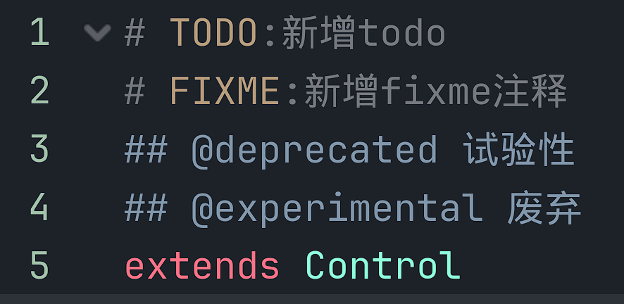
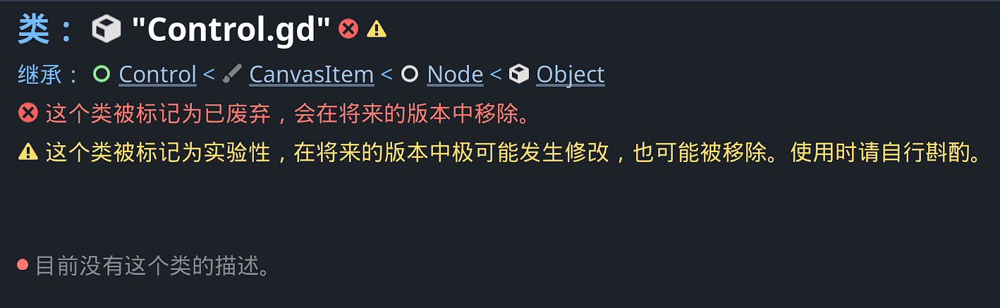
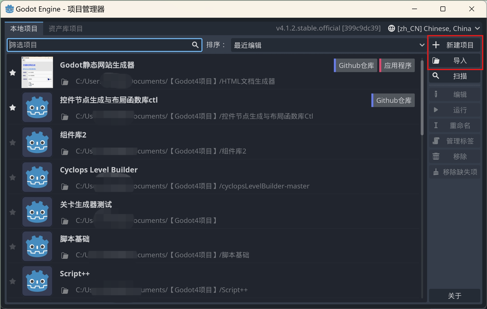
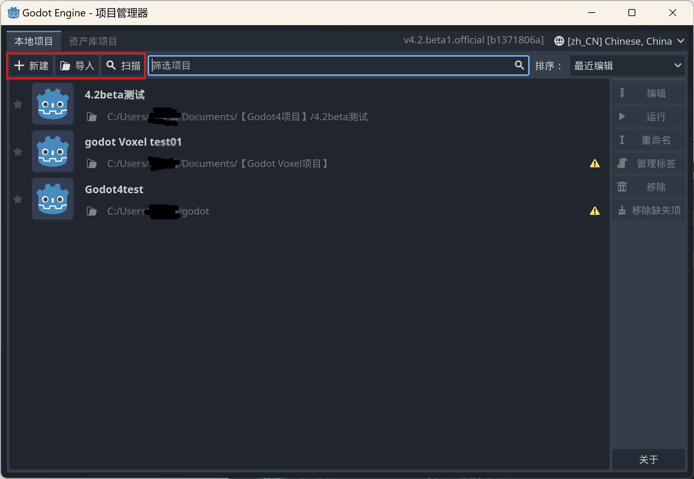
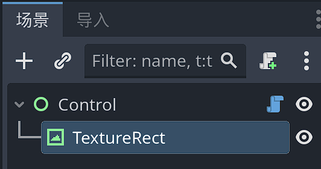
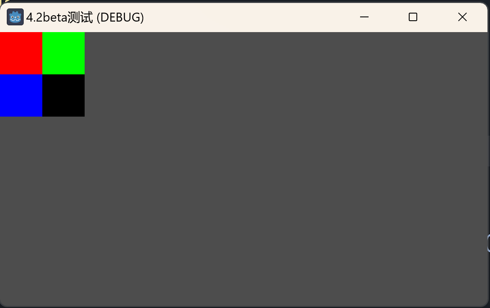

# 4.2新功能

## 文档注释

```sw
# TODO:新增todo
# FIXME:新增fixme注释
## @deprecated 试验性
## @experimental 废弃
```

在实际的编辑器中，会对TODO和FIXME进行颜色上的区分，让人一眼就能看到。



`@deprecated`和`@experimental`分别代表这个类将要或已经废弃，以及试验性的。这对标记动态变化中的类库很有意义。



## EditorInterFace单例化

这对插件开发和使用`EditorScript`都会有一定的影响。

之前都是使用`EditorPlugin.get_editor_interface()`或`EditorScript.get_editor_interface()`形式获取EditorInterFace。

4.2开始将其单独作为了一个单例访问，因此不再需要用EditorPlugin或EditorScript的方法来获取了。

便利性还是有的，当然以前的插件代码又得改一改了。

```swift
@tool
extends EditorScript

func _run():
	# EditorInterface作为单例直接使用
	var base = EditorInterface.get_base_control()
	print(base) # @Panel@711:<Panel#124201732452>
```

## 自带弹窗

在4.1的API中已经存在，对插件开发中使用自定义对话框或窗体非常有用。

```swift
@tool
extends EditorScript

func _run():
	var win = Window.new()
	# 关闭请求处理
	win.connect("close_requested",func():
		win.queue_free()
	)
	# 弹出窗体
	var rect = Rect2i(Vector2i(500,500),Vector2i(600,400))
	EditorInterface.popup_dialog(win,rect)
```

## 项目管理器按钮布局

下面是4.1的项目管理器：



下面是4.2bata的：



## 字符串形式的SVG导入

可以使用Image的load_svg_from_string()方法，传入一个SVG字符串，来创建一个SVG的栅格化图像，然后显示到控件或节点中。

我们创建一个测试场景：



为根节点Control添加如下代码：参考自[拉取请求 #78248 ·戈多引擎/戈多 (github.com)](https://github.com/godotengine/godot/pull/78248)

```swift
extends Control

# SVG字符串
var test_svg := """<?xml version="1.0" encoding="UTF-8"?>
<svg width="4" height="4" version="1.1" viewBox="0 0 1 1" xmlns="http://www.w3.org/2000/svg">
 <g stroke-linecap="square" stroke-width=".4">
  <rect width=".5" height=".5" fill="#f00"/>
  <rect width=".5" height=".5" fill="#f00"/>
  <rect x=".5" width=".5" height=".5" fill="#0f0"/>
  <rect y=".5" width=".5" height=".5" fill="#00f"/>
  <rect x=".5" y=".5" width=".5" height=".5"/>
 </g>
</svg>
"""
@onready var texture_rect = $TextureRect


func _ready():
	# 构建Image实例
	var img = Image.new()
	img.load_svg_from_string(test_svg,50.0)
	# 构建ImageTexture实例
	var tex = ImageTexture.create_from_image(img)
	# 在控件中显示
	texture_rect.texture = tex
```

运行场景后将可以看到SVG图片被正确显示：



这个功能的加入，实际上可以让我们更方便的以文本形式创建和调整游戏素材图。并且有望基于纯文本形式创建图标库之类的。